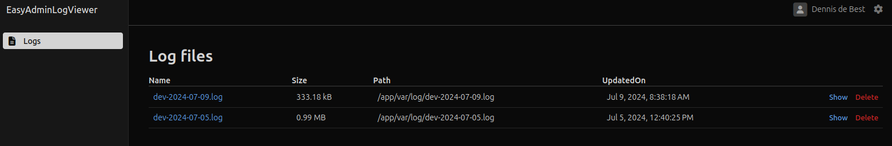
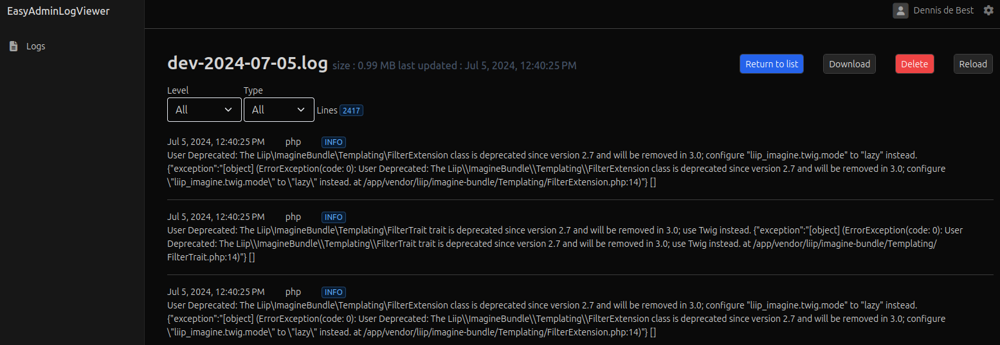
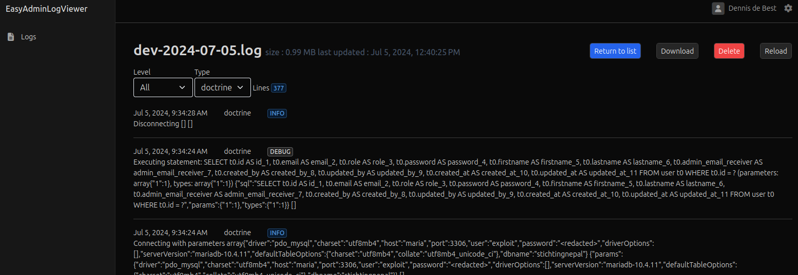
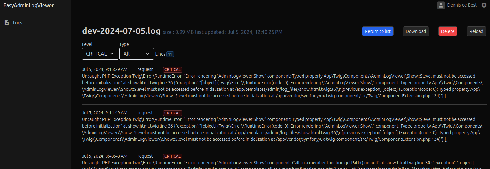

# EasyAdmin Log Viewer Bundle

A Symfony bundle that provides a log viewer interface for EasyAdmin 4, compatible with Symfony 7 and PHP 8.3.

## Features

- View log files directly from your EasyAdmin dashboard
- Download log files
- Delete log files
- Filter log entries by level and type
- Configurable route prefix

## Requirements

- PHP 8.3+
- Symfony 7+
- EasyAdmin 4

## Installation

Use Composer to install the bundle:

```bash
composer require codebuds/easyadmin-log-viewer-bundle
```

## Configuration

Add the bundle to your `config/bundles.php`:

```php
return [
    // ...
    EasyAdminLogViewerBundle::class => ['all' => true],
];
```

Create a configuration file `config/packages/easy_admin_log_viewer.yaml`:

```yaml
easy_admin_log_viewer:
    route_prefix: '/admin'  # Default value, can be customized
    levels:
        - { level: 'INFO', class: 'info' }
        - { level: 'ERROR', class: 'danger' }
        - { level: 'CRITICAL', class: 'danger' }
        - { level: 'DEBUG', class: 'secondary' }
```

The level is what is automatically picked up from the log files. Then a CSS class can be set per level. By default the predefined Bootstrap styles can be used `primary`, `secondary`, `success`, `danger`, `warning`, `info`, `light`, `dark`

### Twig component

A default path has to be added to the `twig_component.yaml` configuration file:

```yaml
twig_component:
    defaults:
				#...
        CodeBuds\EasyAdminLogViewerBundle\Twig\Components\: '@EasyAdminLogViewer/components/'

```

## Routing

The following needs to be added to the applications routes.yaml configuration file:

```yaml
easy_admin_log_viewer:
  resource: '@EasyAdminLogViewerBundle/config/routes.yaml'
  prefix: '%easy_admin_log_viewer.route_prefix%'
```

### Customizing the Route Prefix

You can customize the route prefix in your configuration:

```yaml
easy_admin_log_viewer:
    route_prefix: '/custom-admin'
```

This will change all log viewer routes to start with `/custom-admin` instead of the default `/admin`.

### Adding the log viewer to the dashboard

To see the log files the route can be added to your EasyAdmin dashboard controller:

```php
<?php

namespace App\Controller\Admin;

use EasyCorp\Bundle\EasyAdminBundle\Config\MenuItem;
use EasyCorp\Bundle\EasyAdminBundle\Controller\AbstractDashboardController;

class DashboardController extends AbstractDashboardController
{
    #[\Override]
    public function configureMenuItems(): iterable
    {
        ...
        yield MenuItem::linktoRoute('Logs', 'fa fa-file-alt', 'easy_admin_log_viewer_list')->setPermission('ROLE_ADMIN');
        ...
    }
}
```

### Security
Only users with `ROLE_ADMIN` can access the log viewer interface. Make sure to properly secure your admin routes.

### Contributing
Contributions are welcome! Please feel free to submit a Pull Request.

## Screenshots

### List all the log files


### Show all lines


### Filter by type


### Filter by level

