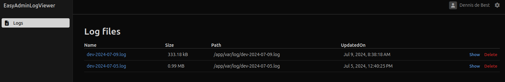
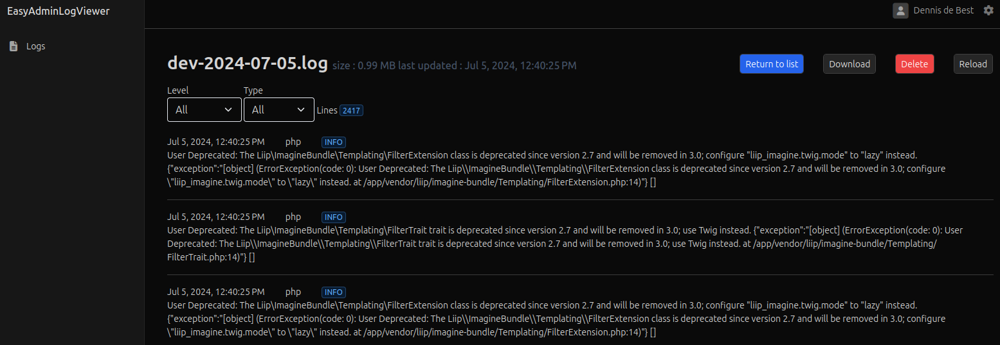
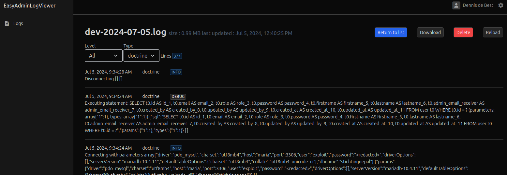
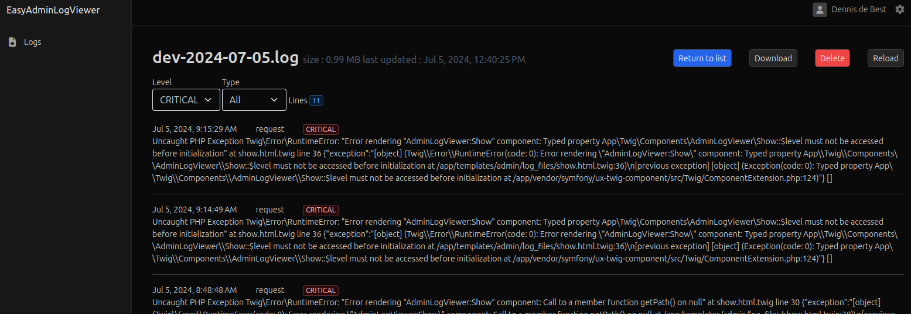

# EasyAdmin Log Viewer Bundle

A Symfony bundle that provides a log viewer interface for EasyAdmin backends.

## Features

- Browse available log files from the admin
- View parsed log entries with multiline stack traces
- Filter log entries by channel and level
- Download log files
- Delete log files
- Configure the admin route prefix

## Requirements

- PHP 8.5+
- Symfony 8+
- EasyAdmin 4.29+ or 5.x

## Installation

Install the bundle with Composer:

```bash
composer require codebuds/easyadmin-log-viewer-bundle
```

Symfony Flex should enable the bundle automatically. Without Flex, add it to `config/bundles.php`:

```php
return [
    // ...
    CodeBuds\EasyAdminLogViewerBundle\EasyAdminLogViewerBundle::class => ['all' => true],
];
```

## Configuration

The bundle works out of the box. If needed, create `config/packages/easy_admin_log_viewer.yaml` to override the defaults:

```yaml
easy_admin_log_viewer:
    route_prefix: '/admin'
    levels:
        - { level: 'EMERGENCY', class: 'danger' }
        - { level: 'CRITICAL', class: 'danger' }
        - { level: 'ERROR', class: 'danger' }
        - { level: 'ALERT', class: 'danger' }
        - { level: 'WARNING', class: 'warning' }
        - { level: 'NOTICE', class: 'info' }
        - { level: 'INFO', class: 'info' }
        - { level: 'DEBUG', class: 'secondary' }
```

The configured `class` values map directly to Bootstrap contextual classes such as `primary`, `secondary`, `success`, `danger`, `warning`, `info`, `light`, and `dark`.

## Routing

Routes are imported automatically by the bundle. You can customize the route prefix like this:

```yaml
easy_admin_log_viewer:
    route_prefix: '/custom-admin'
```

## Adding the Log Viewer to the Dashboard

Add the route to your EasyAdmin dashboard controller:

```php
<?php

namespace App\Controller\Admin;

use EasyCorp\Bundle\EasyAdminBundle\Config\MenuItem;
use EasyCorp\Bundle\EasyAdminBundle\Controller\AbstractDashboardController;

class DashboardController extends AbstractDashboardController
{
    #[\Override]
    public function configureMenuItems(): iterable
    {
        // ...
        yield MenuItem::linkToRoute('Logs', 'fa fa-file-alt', 'easy_admin_log_viewer_list')
            ->setPermission('ROLE_ADMIN');
        // ...
    }
}
```

## Security

Only users with `ROLE_ADMIN` can access the log viewer interface. Make sure your admin area is properly secured.

## Screenshots

### List all log files


### Show all lines


### Filter by type


### Filter by level

